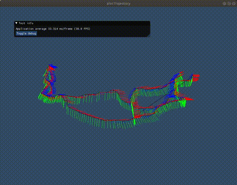
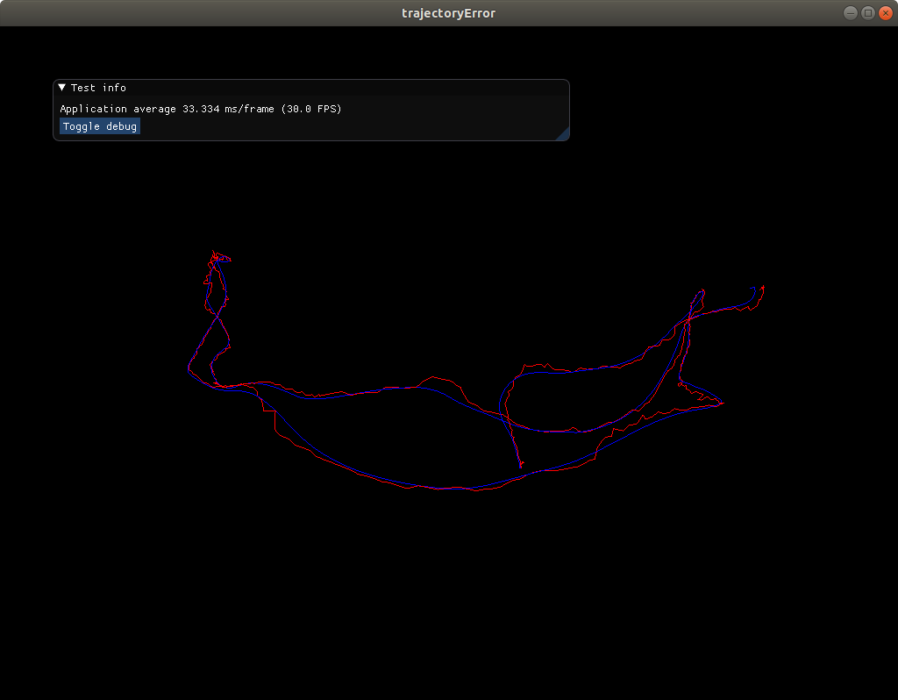
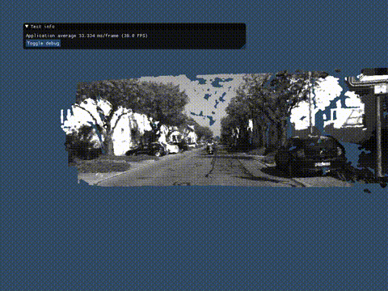

# learning_slambook
Code for learning slambook: https://github.com/gaoxiang12/slambook2

## Results (Visualized using self-made 3d render lib)
- Ch3 plotTrajectory:

  

- Ch4 trajectoryError

  

- Ch5
  - stereoVision (Depth estimation from dual-images)

    

  - rgbd-joinMap (Combine 5 rgb-d images under given poses)

    